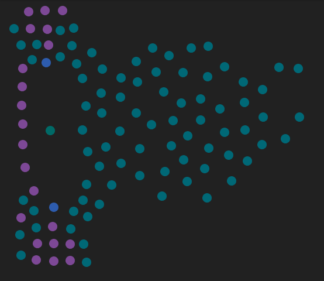

# Synapse


Synapse is an environment for emergence-oriented and reaction-oriented programming.

---

Read the horrible first draft dot pdf to learn more but beware this thing may
die any moment.

DISCLAIMER almost nothing from the AFOREMENTIONED first horrible draft is implemented! A lot
of yak shaving ahead because it's FUN! (it's not)

What's before you is REVISION ONE of the system -- basically a lot of Crystal swearing just
to get it to work with the minimum amount of changes. I am a newb in UI dev (like starting-
from-rectangles kind of UI dev), so this adds up -- adds up to form an enormous pile of
crapcode with different approaches mixed, squashed, distorted and sploshed on the wall.
It runs though, it runs!!

TODO: Write a description here

## Examples

On the GIFs below you'll notice the interesting stuff as well as the bugs/not-working
stuff. At least have fun watching them haha :)

**A sneak peak of Synapse** :


Important: the following gifs use the old UI, and I'm too lazy to re-record them.

**A lot of cells in a group resembling a fish, demonstrating mass signal transmission and suppression**:



**A cell is following mouse, can notify other cells of this fact:**


**A cell emits pings, other cells follow/evade it depending on signal strength:**


**A cell moves in a square, toggles emission of messages every 500ms**:


**Two cells act as turnpoints for another cell, which shares its protocol with a passerby**:


## Installation

TODO: Write installation instructions here

## Usage

```
$ ./build.sh
[compiles Synapse in release to bin/synapse]
```

TODO: Write usage instructions here

## Development

```
$ ./run.sh
[runs Synapse in debug-mode]
```

TODO: Write development instructions here

## Contributing

1. Fork it (<https://github.com/your-github-user/synapse/fork>)
2. Create your feature branch (`git checkout -b my-new-feature`)
3. Commit your changes (`git commit -am 'Add some feature'`)
4. Push to the branch (`git push origin my-new-feature`)
5. Create a new Pull Request

## Contributors

- [Alexey Yurchenko](https://github.com/your-github-user) - creator and maintainer
